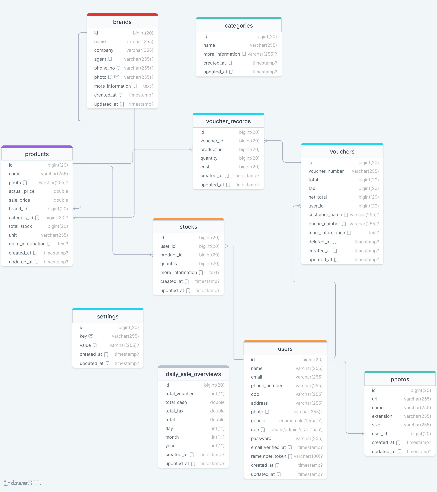

# Web POS API
> API for a POS system written in Laravel
### features
- **inventory**: manage products under a brand & category; manage stocks (ins & outs) of each product
- **sale processing**: generate a voucher for each sale: doing calculation & checking in stock
- **role management**: admin user have all privileges, whereas staff only have access to add voucher; only admin can create or ban a staff and close sale for the current day
- **analysis**: display best sold products & brands; weekly, monthly report

## Database Design

[drawsql.app](https://drawsql.app/teams/hello-world-20/diagrams/web-pos)

### Authentication

All endpoints require authentication using a **bearer token**. The token must be included in the request headers with the key `Authorization`.

```http
Authorization: Bearer 2|uxWwSBeQqRFCNY9GKHOGfaYHpV8EiGOPWJVm8YCm
```

*this documentation is partially generated by <https://github.com/linn221/generate-md-postman.json>*

# Documentation
<!-- TOC start (generated with https://github.com/derlin/bitdowntoc) -->

- [1. Authentication](#1-authentication)
   * [1.1. staff login](#11-staff-login)
   * [1.2. admin login](#12-admin-login)
   * [1.3. test](#13-test)
   * [1.4. admin login (remote credentials)](#14-admin-login-remote-credentials)
- [2. profile](#2-profile)
   * [2.1. users](#21-users)
      + [2.1.1. create user](#211-create-user)
      + [2.1.2. create 2nd user](#212-create-2nd-user)
      + [2.1.3. update user](#213-update-user)
      + [2.1.4. show user](#214-show-user)
      + [2.1.5. modify password](#215-modify-password)
      + [2.1.6. list users](#216-list-users)
      + [2.1.7. ban user](#217-ban-user)
   * [2.2. change password](#22-change-password)
   * [2.3. logout](#23-logout)
   * [2.4. who am i?](#24-who-am-i)
- [3. media](#3-media)
   * [3.1. upload](#31-upload)
   * [3.2. display-media](#32-display-media)
   * [3.3. delete](#33-delete)
   * [3.4. multiple-delete](#34-multiple-delete)
- [4. inventory-management](#4-inventory-management)
   * [4.1. products](#41-products)
      + [4.1.1. store](#411-store)
      + [4.1.2. index](#412-index)
      + [4.1.3. show product](#413-show-product)
      + [4.1.4. update](#414-update)
      + [4.1.5. delete](#415-delete)
   * [4.2. brand](#42-brand)
      + [4.2.1. store](#421-store)
      + [4.2.2. index](#422-index)
      + [4.2.3. show](#423-show)
      + [4.2.4. update](#424-update)
      + [4.2.5. delete](#425-delete)
   * [4.3. stock](#43-stock)
      + [4.3.1. store](#431-store)
      + [4.3.2. index](#432-index)
      + [4.3.3. show](#433-show)
      + [4.3.4. delete](#434-delete)
   * [4.4. categories](#44-categories)
      + [4.4.1. list categories](#441-list-categories)
      + [4.4.2. store category](#442-store-category)
      + [4.4.3. show products under](#443-show-products-under)
      + [4.4.4. update categories](#444-update-categories)
- [5. sale-processing](#5-sale-processing)
   * [voucher](#voucher)
      + [5.1. store voucher](#51-store-voucher)
      + [5.2. list vouchers](#52-list-vouchers)
      + [5.3. show voucher](#53-show-voucher)
      + [5.4. delete voucher](#54-delete-voucher)
      + [5.5. list soft-deleted vouchers](#55-list-soft-deleted-vouchers)
      + [5.6. restore](#56-restore)
      + [5.7. force delete](#57-force-delete)
      + [5.8. empty bin](#58-empty-bin)
      + [5.9. recycle bin](#59-recycle-bin)
- [6. finance](#6-finance)
   * [6.1. daily](#61-daily)
   * [6.2. daily Copy](#62-daily-copy)
   * [6.3. sale close](#63-sale-close)
   * [6.4. open sale](#64-open-sale)
   * [6.5. checkSaleClose](#65-checksaleclose)
   * [6.6. monthly](#66-monthly)
   * [6.7. custom-sale-overview](#67-custom-sale-overview)
- [7. report](#7-report)
   * [7.1. stock-report](#71-stock-report)
      + [7.1.1. stock](#711-stock)
      + [7.1.2. best-seller-brands](#712-best-seller-brands)
      + [7.1.3. testing](#713-testing)
   * [7.2. sale-report](#72-sale-report)
      + [7.2.1. this week](#721-this-week)
      + [7.2.2. this month](#722-this-month)
      + [7.2.3. that month](#723-that-month)
      + [7.2.4. best sale products](#724-best-sale-products)
      + [7.2.5. best sale brands](#725-best-sale-brands)

<!-- TOC end -->

<!-- API Documentation generated with https://github.com/linn221/generate-md-postman.json -->
# 1. Authentication
## 1.1. staff login


**POST**
```http
https://c.mmsdev.site/api/v1/login
```
[*formdata*]

Key      | Type | Value        
-------- | ---- | -------------
email    | text | stu@gmail.com
password | text | password     


## 1.2. admin login


**POST**
```http
https://c.mmsdev.site/api/v1/login
```
[*formdata*]

Key      | Type | Value          
-------- | ---- | ---------------
email    | text | admin@gmail.com
password | text | password       


## 1.3. test


**POST**
```http
https://c.mmsdev.site/api/v1/login
```
[*formdata*]

Key      | Type | Value          
-------- | ---- | ---------------
email    | text | admin@gmail.com
password | text | password       


## 1.4. admin login (remote credentials)


**POST**
```http
https://c.mmsdev.site/api/v1/login
```
[*formdata*]

Key      | Type | Value       
-------- | ---- | ------------
email    | text | a3@gmail.com
password | text | password    


----------------------------
# 2. profile
## 2.1. users
### 2.1.1. create user

Note:
only admin can create user\
\
**POST**
```http
https://c.mmsdev.site/api/v1/user
```
[*formdata*]

Key          | Type | Value                  
------------ | ---- | -----------------------
name         | text | steve                  
email        | text | steve@gmail.com        
password     | text | password               
phone_number | text | 0988888865             
dob          | text | 1.2.1999               
gender       | text | male                   
address      | text | new york, united states
role         | text | staff                  
photo        | text |                        


### 2.1.2. create 2nd user


**POST**
```http
https://c.mmsdev.site/api/v1/user
```
[*formdata*]

Key          | Type | Value                  
------------ | ---- | -----------------------
name         | text | Staff                  
email        | text | stu@gmail.com          
password     | text | asdffdsa               
phone_number | text | 0988888865             
dob          | text | 1.2.1999               
gender       | text | male                   
address      | text | new york, united states
role         | text | staff                  
photo        | text | shit                   


### 2.1.3. update user

Note:
staff user can update his info, admin have all previliges, staff cannot update to admin\
\
**PUT**
```http
https://c.mmsdev.site/api/v1/user/4
```
[*urlencoded*]

Key          | Type | Value              
------------ | ---- | -------------------
name         | text | linn               
email        | text | linn@gmail.com     
password     | text | asdffdsa           
phone_number | text | 0988888865         
dob          | text | 1.2.1002           
gender       | text | male               
address      | text | hello worlddddddddd
role         | text | staff              


### 2.1.4. show user


**GET**
```http
https://c.mmsdev.site/api/v1/user/2
```

### 2.1.5. modify password


**POST**
```http
https://c.mmsdev.site/api/v1/change-staff-password
```
[*formdata*]

Key          | Type | Value    
------------ | ---- | ---------
user_id      | text | 3        
new_password | text | asdfghjkl


### 2.1.6. list users


**GET**
```http
https://c.mmsdev.site/api/v1/user
```

### 2.1.7. ban user

Note:
only admin can ban a user, banned user can no longer log in, and all his sessions will be destroyed\
\
**POST**
```http
https://c.mmsdev.site/api/v1/ban-user/3
```

----------------------------
## 2.2. change password


**POST**
```http
https://c.mmsdev.site/api/v1/change-password
```
[*formdata*]

Key              | Type | Value    
---------------- | ---- | ---------
current_password | text | password 
new_password     | text | asdfghjkl


## 2.3. logout


**POST**
```http
https://c.mmsdev.site/api/v1/logout
```

## 2.4. who am i?


**GET**
```http
https://c.mmsdev.site/api/v1/profile
```

----------------------------
# 3. media
## 3.1. upload


**POST**
```http
https://c.mmsdev.site/api/v1/photo
```
[*formdata*]

Key      | Type | Value
-------- | ---- | -----
photos[] | file |      


## 3.2. display-media


**GET**
```http
https://c.mmsdev.site/api/v1/photo
```

## 3.3. delete


**DELETE**
```http
https://c.mmsdev.site/api/v1/photo/26
```

## 3.4. multiple-delete


**POST**
```http
https://c.mmsdev.site/api/v1/photo/multiple-delete
```
[*raw*]

```json
{
    "ids": [
        1,
        3
    ]
}
```


----------------------------
# 4. inventory-management
## 4.1. products
### 4.1.1. store


**POST**
```http
https://c.mmsdev.site/api/v1/product
```
[*formdata*]

Key              | Type | Value                
---------------- | ---- | ---------------------
name             | text | Toothpaste           
brand_id         | text | 1                    
actual_price     | text | 1500                 
sale_price       | text | 1800                 
unit             | text | dozen                
more_information | text | it&#39;s a toothpaste
category_id      | text | 1                    


### 4.1.2. index


**GET**
```http
https://c.mmsdev.site/api/v1/product
```

### 4.1.3. show product


**GET**
```http
https://c.mmsdev.site/api/v1/product/13
```

### 4.1.4. update


**PUT**
```http
https://c.mmsdev.site/api/v1/product/30
```
[*urlencoded*]

Key              | Type | Value                
---------------- | ---- | ---------------------
name             | text | totam                
brand_id         | text | 2                    
category_id      | text | 3                    
actual_price     | text | 1500                 
sale_price       | text | 1800                 
unit             | text | dozen                
more_information | text | it&#39;s a toothpaste


### 4.1.5. delete


**DELETE**
```http
https://c.mmsdev.site/api/v1/product/7
```

----------------------------
## 4.2. brand
### 4.2.1. store


**POST**
```http
https://c.mmsdev.site/api/v1/brand
```
[*formdata*]

Key         | Type | Value                                                                                                                                                         
----------- | ---- | --------------------------------------------------------------------------------------------------------------------------------------------------------------
name        | text | Ash                                                                                                                                                           
company     | text | barman                                                                                                                                                        
description | text | Instead of defining all of your request handling logic as closures in your route files, you may wish to organize this behavior using  classes. Controllers can
agent       | text | Smith                                                                                                                                                         
phone_no    | text | 0996534554                                                                                                                                                    


### 4.2.2. index


**GET**
```http
https://c.mmsdev.site/api/v1/brand
```

### 4.2.3. show


**GET**
```http
https://c.mmsdev.site/api/v1/brand/15
```

### 4.2.4. update


**PUT**
```http
https://c.mmsdev.site/api/v1/brand/5
```
[*urlencoded*]

Key         | Type | Value                                                                                                                                                         
----------- | ---- | --------------------------------------------------------------------------------------------------------------------------------------------------------------
name        | text | Butt                                                                                                                                                          
company     | text | butt man                                                                                                                                                      
description | text | Instead of defining all of your request handling logic as closures in your route files, you may wish to organize this behavior using  classes. Controllers can
agent       | text | Smith                                                                                                                                                         
phone_no    | text | 0996534554                                                                                                                                                    


### 4.2.5. delete


**DELETE**
```http
https://c.mmsdev.site/api/v1/brand/5
```

----------------------------
## 4.3. stock
### 4.3.1. store


**POST**
```http
https://c.mmsdev.site/api/v1/stock
```
[*formdata*]

Key              | Type | Value                                                                                                                          
---------------- | ---- | -------------------------------------------------------------------------------------------------------------------------------
product_id       | text | 29                                                                                                                             
quantity         | text | 30                                                                                                                             
more_information | text | down to the underlying model for convenient access. Once the resource is defined, it may be returned from a route or controller


### 4.3.2. index


**GET**
```http
https://c.mmsdev.site/api/v1/stock
```

### 4.3.3. show


**GET**
```http
https://c.mmsdev.site/api/v1/stock/6
```

### 4.3.4. delete


**DELETE**
```http
https://c.mmsdev.site/api/v1/stock/1
```

----------------------------
## 4.4. categories
### 4.4.1. list categories


**GET**
```http
https://c.mmsdev.site/api/v1/category
```

### 4.4.2. store category


**POST**
```http
https://c.mmsdev.site/api/v1/category
```
[*formdata*]

Key              | Type | Value   
---------------- | ---- | --------
name             | text | sex toys
more_information | text | sex toys


### 4.4.3. show products under


**GET**
```http
https://c.mmsdev.site/api/v1/category/1
```

### 4.4.4. update categories


**PUT**
```http
https://c.mmsdev.site/api/v1/category/1
```
[*urlencoded*]

Key     | Type | Value     
------- | ---- | ----------
name    | text | pizza pie!
more_in | text |           


----------------------------
# 5. sale-processing
## voucher
### 5.1. store voucher


**POST**
```http
https://c.mmsdev.site/api/v1/voucher
```
[*raw*]

```json
{
    "voucher_number": "v123456",
    "more_information": "Facere est voluptas autem ut eum ab sint dolore aut.",
    "customer_name": "Khaing Thin Thin Htay",
    "phone_number": "09-14248814",
    "records": [
        {
            "product_id": 29,
            "quantity": 29
        },
        {
            "product_id": 2,
            "quantity": 66
        }
    ]
}
```


### 5.2. list vouchers


**GET**
```http
https://c.mmsdev.site/api/v1/voucher
```

### 5.3. show voucher


**GET**
```http
https://c.mmsdev.site/api/v1/voucher/42
```

### 5.4. delete voucher


**DELETE**
```http
https://c.mmsdev.site/api/v1/voucher/52
```

### 5.5. list soft-deleted vouchers


**GET**
```http
https://c.mmsdev.site/api/v1/voucher/show-trash
```

### 5.6. restore


**POST**
```http
https://c.mmsdev.site/api/v1/voucher/restore/25
```

### 5.7. force delete


**POST**
```http
https://c.mmsdev.site/api/v1/voucher/force-delete/3
```

### 5.8. empty bin


**POST**
```http
https://c.mmsdev.site/api/v1/voucher/empty-bin
```

### 5.9. recycle bin


**POST**
```http
https://c.mmsdev.site/api/v1/voucher/recycle-bin
```

----------------------------
# 6. finance
## 6.1. daily


**GET**
```http
https://c.mmsdev.site/api/v1/finance/daily/17-09-2023
```

## 6.2. daily Copy


**GET**
```http
https://c.mmsdev.site/api/v1/finance/daily/17-09-2023
```

## 6.3. sale close

Note:
only admin can close/open sale, sale status doesn't required to open, implicitly done by current date\
\
**POST**
```http
https://c.mmsdev.site/api/v1/finance/close-sale
```

## 6.4. open sale


**POST**
```http
https://c.mmsdev.site/api/v1/finance/close-sale?false
```

## 6.5. checkSaleClose


**GET**
```http
https://c.mmsdev.site/api/v1/finance/sale-close-check
```

## 6.6. monthly


**GET**
```http
https://c.mmsdev.site/api/v1/finance/monthly/1-2-2023
```

## 6.7. custom-sale-overview


**GET**
```http
https://c.mmsdev.site/api/v1/finance/custom-sale-overview/2023-09-01/2023-09-20
```

----------------------------
# 7. report
## 7.1. stock-report
### 7.1.1. stock


**GET**
```http
https://c.mmsdev.site/api/v1/stock-report?stock_level=in stock
```

### 7.1.2. best-seller-brands


**GET**
```http
https://c.mmsdev.site/api/v1/weekly-best-seller-brand
```

### 7.1.3. testing


**GET**
```http
https://c.mmsdev.site/api/v1/sale-reprot-weekly
```

----------------------------
## 7.2. sale-report
### 7.2.1. this week


**GET**
```http
https://c.mmsdev.site/api/v1/sale-report/current-week
```

### 7.2.2. this month


**GET**
```http
https://c.mmsdev.site/api/v1/sale-report/current-month
```

### 7.2.3. that month


**GET**
```http
https://c.mmsdev.site/api/v1/sale-report/current-month?month=1
```

### 7.2.4. best sale products


**GET**
```http
https://c.mmsdev.site/api/v1/sale-report/best-sale-products
```

### 7.2.5. best sale brands


**GET**
```http
https://c.mmsdev.site/api/v1/sale-report/best-sale-brands
```

----------------------------

